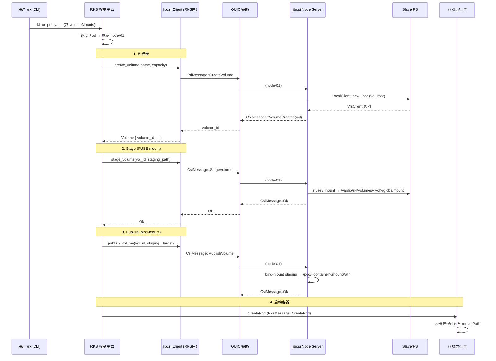

# libcsi 设计调研文档


## 1. 背景与目标

### 1.1 项目背景

RK8s 是一个轻量级的 Rust 原生 Kubernetes 兼容编排系统，当前已具备：

- **RKS** — 控制平面（调度器 + 状态管理 + 控制器），通过 QUIC（quinn）与节点通信
- **RKL** — 容器/Pod 运行时引擎
- **SlayerFS** — 高性能 Rust 分层分布式文件系统，提供 Chunk/Block 布局、FUSE 挂载、SDK 路径 API
- **common crate** — 定义 `RksMessage` 枚举、`RksConnection`/`RksStream` QUIC 通信抽象、`PodTask`/`PodSpec`/`VolumeMount` 等共享类型

当前 `PodSpec` 已有 `VolumeMount`（name + mountPath + readOnly），但缺少 **Volume 生命周期管理**（创建、挂载、卸载、删除）以及与 SlayerFS 的对接层。标准 Kubernetes 通过 CSI（Container Storage Interface）基于 gRPC 实现该功能，而 RK8s 规定采用 **QUIC 协议**替代 gRPC。

### 1.2 设计目标

`libcsi` 作为 RK8s 的存储接口库，实现**简化版 CSI**，核心目标：

1. **定义存储操作的 trait 抽象**（Identity / Controller / Node 三组语义）
2. **基于 QUIC（quinn）实现 RKS ↔ libcsi ↔ SlayerFS 的通信链路**
3. **覆盖 Pod 创建时 Volume 挂载、Pod 删除时 Volume 卸载的完整流程**
4. **可插拔后端**：首期对接 SlayerFS，后续可扩展对接其他存储

---

## 2. 标准 CSI 概览与简化映射

### 2.1 标准 CSI 三组服务

| 服务 | 职责 | 关键 RPC |
|------|------|----------|
| **Identity** | 插件能力发现 | `GetPluginInfo`, `GetPluginCapabilities`, `Probe` |
| **Controller** | 集中式卷管理（在控制平面调用） | `CreateVolume`, `DeleteVolume`, `ControllerPublishVolume`, `ControllerUnpublishVolume`, `ValidateVolumeCapabilities` |
| **Node** | 节点本地挂载/卸载（在工作节点调用） | `NodeStageVolume`, `NodeUnstageVolume`, `NodePublishVolume`, `NodeUnpublishVolume`, `NodeGetInfo` |

### 2.2 RK8s 简化映射

由于 RK8s 是轻量编排系统，可做以下简化：

| 标准 CSI | libcsi 简化 | 说明 |
|----------|-------------|------|
| Identity Service | `CsiIdentity` trait | 保留插件发现能力，用于健康检查 |
| Controller CreateVolume/DeleteVolume | `CsiController::create_volume` / `delete_volume` | RKS 控制平面在调度时调用 |
| Controller Publish/Unpublish | 合并到 Node 阶段 | 单节点/轻量场景不需要独立的 attach/detach |
| Node Stage/Unstage | `CsiNode::stage_volume` / `unstage_volume` | 在节点上准备全局挂载点（SlayerFS FUSE mount） |
| Node Publish/Unpublish | `CsiNode::publish_volume` / `unpublish_volume` | bind-mount 到 Pod 容器的 mountPath |

### 2.3 简化后完整操作时序

```
Create Pod 流程:
  RKS 调度 Pod → RKS 调 libcsi Controller::create_volume
    → libcsi 通过 QUIC 发 CreateVolume 请求给目标节点的 libcsi Node 服务
      → Node 服务调 SlayerFS SDK 创建卷文件系统实例
  → RKS 调 NodeStageVolume (QUIC)
    → Node 上 FUSE mount SlayerFS 到全局挂载点
  → RKS 调 NodePublishVolume (QUIC)
    → Node 上 bind-mount 全局挂载点到 Pod 的容器路径
  → Pod 容器启动，可读写该路径

Delete Pod 流程:
  RKS 停止 Pod → RKS 调 NodeUnpublishVolume (QUIC)
    → Node 上 umount bind-mount
  → RKS 调 NodeUnstageVolume (QUIC)
    → Node 上 fusermount3 -u 卸载 SlayerFS FUSE
  → RKS 调 Controller::delete_volume (可选，取决于回收策略)
    → 清理 SlayerFS 中的卷数据
```

---

## 3. 架构设计

### 3.1 整体调用链

```
┌──────────┐     QUIC (quinn)      ┌───────────┐     Rust API      ┌────────────┐
│   RKS    │ ◄──────────────────► │  libcsi   │ ◄──────────────► │  SlayerFS  │
│ 控制平面  │   CsiMessage 消息    │ (Node端)  │  ClientBackend   │   SDK/VFS  │
└──────────┘                       └───────────┘                   └────────────┘
     │                                  │
     │  调度决策: 哪个节点、哪个卷       │  本地操作:
     │  Volume 生命周期编排             │  - SlayerFS mkdir_p / create
     │                                  │  - FUSE mount / umount
     │                                  │  - bind-mount → 容器路径
```

### 3.2 模块划分

```
libcsi/
├── Cargo.toml
├── README.md
├── docs/
│   └── design.md          ← 本文档
└── src/
    ├── lib.rs             ← 公共导出
    ├── error.rs           ← CsiError (thiserror)
    ├── types.rs           ← Volume、VolumeCapability、Topology 等核心类型
    ├── message.rs         ← CsiMessage 枚举（QUIC 传输协议消息）
    ├── identity.rs        ← CsiIdentity trait
    ├── controller.rs      ← CsiController trait
    ├── node.rs            ← CsiNode trait
    ├── transport/
    │   ├── mod.rs
    │   ├── server.rs      ← QUIC 服务端（Node 端运行）
    │   └── client.rs      ← QUIC 客户端（RKS 端调用）
    └── backend/
        ├── mod.rs
        └── slayerfs.rs    ← SlayerFS 后端实现
```

---

## 4. 核心类型设计

### 4.1 Volume 与相关类型

```rust
use serde::{Deserialize, Serialize};
use std::collections::HashMap;

/// 卷的唯一标识
#[derive(Debug, Clone, Serialize, Deserialize, PartialEq, Eq, Hash)]
pub struct VolumeId(pub String);

/// 卷的访问模式
#[derive(Debug, Clone, Serialize, Deserialize, PartialEq, Eq)]
pub enum AccessMode {
    ReadWriteOnce,     // 单节点读写
    ReadOnlyMany,      // 多节点只读
    ReadWriteMany,     // 多节点读写
}

/// 卷能力描述
#[derive(Debug, Clone, Serialize, Deserialize)]
pub struct VolumeCapability {
    pub access_mode: AccessMode,
    /// mount 类型的参数
    pub mount_flags: Vec<String>,
    /// 文件系统类型（对 SlayerFS 而言固定为 "slayerfs"）
    pub fs_type: String,
}

/// 卷的元信息
#[derive(Debug, Clone, Serialize, Deserialize)]
pub struct Volume {
    pub volume_id: VolumeId,
    pub capacity_bytes: u64,
    pub parameters: HashMap<String, String>,    // 用户自定义参数
    pub volume_context: HashMap<String, String>, // 传递给 Node 的上下文
    pub accessible_topology: Vec<Topology>,
}

/// 拓扑约束
#[derive(Debug, Clone, Serialize, Deserialize)]
pub struct Topology {
    pub segments: HashMap<String, String>, // e.g. {"node": "node-01"}
}

/// 创建卷请求
#[derive(Debug, Clone, Serialize, Deserialize)]
pub struct CreateVolumeRequest {
    pub name: String,
    pub capacity_bytes: u64,
    pub volume_capabilities: Vec<VolumeCapability>,
    pub parameters: HashMap<String, String>,
}

/// 阶段挂载请求（全局挂载点）
#[derive(Debug, Clone, Serialize, Deserialize)]
pub struct NodeStageVolumeRequest {
    pub volume_id: VolumeId,
    pub staging_target_path: String,  // 全局挂载点, e.g. /var/lib/rkl/volumes/<vol-id>/globalmount
    pub volume_capability: VolumeCapability,
    pub volume_context: HashMap<String, String>,
}

/// 发布挂载请求（Pod 容器路径）
#[derive(Debug, Clone, Serialize, Deserialize)]
pub struct NodePublishVolumeRequest {
    pub volume_id: VolumeId,
    pub staging_target_path: String,  // Stage 阶段的全局挂载点
    pub target_path: String,          // Pod 容器内的 mountPath
    pub volume_capability: VolumeCapability,
    pub read_only: bool,
}
```

### 4.2 Error 类型

```rust
use thiserror::Error;

#[derive(Debug, Error, Serialize, Deserialize, Clone)]
pub enum CsiError {
    #[error("volume {0} already exists")]
    VolumeAlreadyExists(String),

    #[error("volume {0} not found")]
    VolumeNotFound(String),

    #[error("mount failed at {path}: {reason}")]
    MountFailed { path: String, reason: String },

    #[error("unmount failed at {path}: {reason}")]
    UnmountFailed { path: String, reason: String },

    #[error("slayerfs backend error: {0}")]
    BackendError(String),

    #[error("transport error: {0}")]
    TransportError(String),

    #[error("invalid argument: {0}")]
    InvalidArgument(String),

    #[error("internal error: {0}")]
    Internal(String),
}
```

---

## 5. Trait 定义

### 5.1 CsiIdentity

```rust
#[async_trait::async_trait]
pub trait CsiIdentity: Send + Sync {
    /// 返回插件名称和版本
    async fn get_plugin_info(&self) -> Result<PluginInfo, CsiError>;

    /// 健康探针
    async fn probe(&self) -> Result<bool, CsiError>;

    /// 返回插件支持的能力
    async fn get_plugin_capabilities(&self) -> Result<Vec<PluginCapability>, CsiError>;
}

#[derive(Debug, Clone, Serialize, Deserialize)]
pub struct PluginInfo {
    pub name: String,       // e.g. "rk8s.slayerfs.csi"
    pub vendor_version: String,
}

#[derive(Debug, Clone, Serialize, Deserialize)]
pub enum PluginCapability {
    ControllerService,
    VolumeAccessibilityConstraints,
}
```

### 5.2 CsiController

```rust
#[async_trait::async_trait]
pub trait CsiController: Send + Sync {
    /// 创建卷（控制平面调用）
    async fn create_volume(&self, req: CreateVolumeRequest) -> Result<Volume, CsiError>;

    /// 删除卷
    async fn delete_volume(&self, volume_id: &VolumeId) -> Result<(), CsiError>;

    /// 验证卷能力
    async fn validate_volume_capabilities(
        &self,
        volume_id: &VolumeId,
        capabilities: &[VolumeCapability],
    ) -> Result<bool, CsiError>;

    /// 列出已有卷
    async fn list_volumes(&self) -> Result<Vec<Volume>, CsiError>;

    /// 获取容量信息
    async fn get_capacity(&self) -> Result<u64, CsiError>;
}
```

### 5.3 CsiNode

```rust
#[async_trait::async_trait]
pub trait CsiNode: Send + Sync {
    /// Stage: 在节点全局挂载点挂载 SlayerFS（FUSE mount）
    async fn stage_volume(&self, req: NodeStageVolumeRequest) -> Result<(), CsiError>;

    /// Unstage: 卸载全局挂载点
    async fn unstage_volume(
        &self,
        volume_id: &VolumeId,
        staging_target_path: &str,
    ) -> Result<(), CsiError>;

    /// Publish: bind-mount 全局挂载点到 Pod 容器的 target_path
    async fn publish_volume(&self, req: NodePublishVolumeRequest) -> Result<(), CsiError>;

    /// Unpublish: 卸载 bind-mount
    async fn unpublish_volume(
        &self,
        volume_id: &VolumeId,
        target_path: &str,
    ) -> Result<(), CsiError>;

    /// 返回当前节点的信息
    async fn get_info(&self) -> Result<NodeInfo, CsiError>;
}

#[derive(Debug, Clone, Serialize, Deserialize)]
pub struct NodeInfo {
    pub node_id: String,
    pub max_volumes: u64,
    pub accessible_topology: Option<Topology>,
}
```

---

## 6. QUIC 通信协议设计

### 6.1 设计原则 — 复用 RK8s 现有模式

RK8s 已在 `common` crate 中建立了成熟的 QUIC 通信模式：

- **quinn** 作为 QUIC 库，`rustls` TLS
- `RksConnection` / `RksStream` 封装连接和流
- `SendStreamExt` / `RecvStreamExt` trait 提供 `send_msg` / `fetch_msg`
- 消息体通过 **serde_json 序列化** 在 QUIC 流上传输
- 单向流（`open_uni` / `accept_uni`）用于无需回复的通知
- 双向流（`open_bi` / `accept_bi`）用于请求-响应模式

libcsi 应复用此模式，**推荐方案有两种**：

#### 方案 A：扩展 `RksMessage` 枚举（推荐）

在现有的 `common::RksMessage` 中增加 CSI 相关变体：

```rust
pub enum RksMessage {
    // ... 现有变体 ...

    // CSI Volume 操作
    CsiCreateVolume(CreateVolumeRequest),
    CsiDeleteVolume(VolumeId),
    CsiStageVolume(NodeStageVolumeRequest),
    CsiUnstageVolume { volume_id: VolumeId, staging_target_path: String },
    CsiPublishVolume(NodePublishVolumeRequest),
    CsiUnpublishVolume { volume_id: VolumeId, target_path: String },
    CsiProbe,

    // CSI 响应
    CsiVolumeCreated(Volume),
    CsiOk,
    CsiError(CsiError),
}
```

**优点**：与现有 RKS ↔ RKL 通信完全一致，无需额外端口/连接；Node 端 dispatch 逻辑直接在现有 QUIC handler 中增加分支。

**缺点**：`RksMessage` 膨胀，CSI 逻辑耦合进 common。

#### 方案 B：独立 `CsiMessage` + 独立 QUIC 端口

libcsi 定义自己的消息类型和独立的 QUIC Server/Client：

```rust
#[derive(Debug, Clone, Serialize, Deserialize)]
pub enum CsiMessage {
    // 请求
    CreateVolume(CreateVolumeRequest),
    DeleteVolume(VolumeId),
    StageVolume(NodeStageVolumeRequest),
    UnstageVolume { volume_id: VolumeId, staging_target_path: String },
    PublishVolume(NodePublishVolumeRequest),
    UnpublishVolume { volume_id: VolumeId, target_path: String },
    Probe,
    ListVolumes,
    GetCapacity,

    // 响应
    VolumeCreated(Volume),
    VolumeList(Vec<Volume>),
    Capacity(u64),
    Ok,
    Error(CsiError),
}
```

**优点**：解耦、独立演进、消息体清晰。

**缺点**：需要额外端口和连接管理。

### 6.2 推荐：方案 B（独立 CsiMessage）+ 共享 TLS 基础设施

理由：
1. **关注点分离** — 存储生命周期与 Pod 调度解耦
2. **独立升级** — 存储协议可独立版本化
3. **TLS 复用** — 直接复用 `libvault` 签发证书逻辑和现有 `build_quic_config` 模式
4. **通信模式复用** — 复刻 `common::quic` 中的 `SendStreamExt` / `RecvStreamExt`，用 serde_json + QUIC 双向流 (bi-stream) 实现 request-response

### 6.3 传输层封装

```rust
// transport/client.rs — RKS 端使用
pub struct CsiClient {
    connection: quinn::Connection,
}

impl CsiClient {
    pub async fn connect(addr: SocketAddr, tls_config: ClientConfig) -> Result<Self, CsiError> {
        let mut endpoint = quinn::Endpoint::client("0.0.0.0:0".parse().unwrap())?;
        endpoint.set_default_client_config(quinn::ClientConfig::new(Arc::new(
            quinn::crypto::rustls::QuicClientConfig::try_from(tls_config)?
        )));
        let connection = endpoint.connect(addr, "libcsi")?.await?;
        Ok(Self { connection })
    }

    /// 发送请求并等待响应（双向流）
    pub async fn request(&self, msg: &CsiMessage) -> Result<CsiMessage, CsiError> {
        let (mut send, mut recv) = self.connection.open_bi().await
            .map_err(|e| CsiError::TransportError(e.to_string()))?;

        // 发送
        let payload = serde_json::to_vec(msg)
            .map_err(|e| CsiError::Internal(e.to_string()))?;
        send.write_all(&payload).await
            .map_err(|e| CsiError::TransportError(e.to_string()))?;
        send.finish().map_err(|e| CsiError::TransportError(e.to_string()))?;

        // 接收
        let mut buf = Vec::new();
        let mut chunk = vec![0u8; 4096];
        while let Some(n) = recv.read(&mut chunk).await
            .map_err(|e| CsiError::TransportError(e.to_string()))? {
            buf.extend_from_slice(&chunk[..n]);
        }

        serde_json::from_slice(&buf)
            .map_err(|e| CsiError::TransportError(e.to_string()))
    }
}
```

```rust
// transport/server.rs — Node 端运行
pub struct CsiServer<N: CsiNode, C: CsiController> {
    endpoint: quinn::Endpoint,
    node_service: Arc<N>,
    controller_service: Arc<C>,
}

impl<N: CsiNode, C: CsiController> CsiServer<N, C> {
    pub async fn serve(&self) -> Result<(), CsiError> {
        loop {
            let incoming = self.endpoint.accept().await
                .ok_or(CsiError::TransportError("endpoint closed".into()))?;
            let conn = incoming.await
                .map_err(|e| CsiError::TransportError(e.to_string()))?;
            let node = self.node_service.clone();
            let ctrl = self.controller_service.clone();
            tokio::spawn(async move {
                Self::handle_connection(conn, node, ctrl).await
            });
        }
    }

    async fn handle_connection(
        conn: quinn::Connection,
        node: Arc<N>,
        ctrl: Arc<C>,
    ) -> Result<(), CsiError> {
        loop {
            let (send, recv) = conn.accept_bi().await
                .map_err(|e| CsiError::TransportError(e.to_string()))?;
            let node = node.clone();
            let ctrl = ctrl.clone();
            tokio::spawn(async move {
                let response = Self::dispatch(recv, &node, &ctrl).await;
                // 序列化响应并发回 send stream
            });
        }
    }

    async fn dispatch(
        recv: quinn::RecvStream,
        node: &N,
        ctrl: &C,
    ) -> CsiMessage {
        // 1) 从 recv 读取并反序列化 CsiMessage
        // 2) match 到对应的 trait 方法调用
        // 3) 返回响应 CsiMessage
        todo!()
    }
}
```

### 6.4 为什么用 QUIC 而不用 gRPC

| 维度 | gRPC | QUIC (quinn) |
|------|------|-------------|
| 传输层 | HTTP/2 over TCP | QUIC (UDP, 内建 TLS 1.3) |
| 连接建立 | 2-3 RTT (TCP + TLS) | **1 RTT**（0-RTT 重连） |
| 多路复用 | 有队头阻塞（HTTP/2 层） | **无队头阻塞**（每条流独立） |
| 依赖 | tonic + prost + protobuf codegen | quinn + rustls + serde（**纯 Rust，无 codegen**） |
| 与 RK8s 一致性 | 需引入额外协议栈 | **与现有 RKS↔RKL 通信统一** |
| 连接迁移 | 不支持 | 支持（IP 变更不断连） |

RK8s 已全面采用 quinn，libcsi 使用 QUIC 可保持技术栈一致，减少外部依赖。

---

## 7. SlayerFS 后端对接

### 7.1 SlayerFS SDK 能力总结

SlayerFS 提供了 `ClientBackend` trait 和 `LocalClient` / `VfsClient`，核心 API：

| 操作 | SlayerFS API | 用途 |
|------|-------------|------|
| 创建卷目录 | `mkdir_p(path)` | 在 SlayerFS 中为每个 Volume 创建独立子目录 |
| 文件读写 | `create_file`, `write_at`, `read_at` | 卷内数据操作 |
| 目录列举 | `readdir(path)` | 列出卷内容 |
| 删除 | `rmdir`, `unlink`, `remove_dir_all` | 卷清理 |
| 属性 | `stat`, `exists` | 检查卷是否存在 |
| FUSE 挂载 | rfuse3 VFS 层 | 将卷暴露为本地文件系统 |

### 7.2 后端实现策略

```rust
// backend/slayerfs.rs

use slayerfs::{LocalClient, ChunkLayout, VfsClient};

pub struct SlayerFsBackend {
    /// SlayerFS 对象存储根目录
    object_root: PathBuf,
    /// Chunk 布局配置
    layout: ChunkLayout,
    /// 已创建的卷 → 对应的 VfsClient
    volumes: DashMap<VolumeId, Arc<dyn ClientBackend>>,
}

#[async_trait]
impl CsiController for SlayerFsBackend {
    async fn create_volume(&self, req: CreateVolumeRequest) -> Result<Volume, CsiError> {
        let vol_id = VolumeId(format!("slayerfs-{}", uuid::Uuid::new_v4()));
        let vol_root = self.object_root.join(&vol_id.0);

        // 创建 SlayerFS 客户端实例
        let client = LocalClient::new_local(vol_root.to_str().unwrap(), self.layout)
            .await
            .map_err(|e| CsiError::BackendError(e.to_string()))?;

        // 创建卷的根目录
        client.mkdir_p("/").await
            .map_err(|e| CsiError::BackendError(e.to_string()))?;

        self.volumes.insert(vol_id.clone(), Arc::new(client));

        Ok(Volume {
            volume_id: vol_id,
            capacity_bytes: req.capacity_bytes,
            parameters: req.parameters,
            volume_context: HashMap::from([
                ("object_root".into(), vol_root.to_string_lossy().into()),
            ]),
            accessible_topology: vec![],
        })
    }

    async fn delete_volume(&self, volume_id: &VolumeId) -> Result<(), CsiError> {
        self.volumes.remove(volume_id);
        let vol_root = self.object_root.join(&volume_id.0);
        tokio::fs::remove_dir_all(&vol_root).await
            .map_err(|e| CsiError::BackendError(e.to_string()))?;
        Ok(())
    }

    // ...
}

#[async_trait]
impl CsiNode for SlayerFsBackend {
    async fn stage_volume(&self, req: NodeStageVolumeRequest) -> Result<(), CsiError> {
        let object_root = req.volume_context.get("object_root")
            .ok_or(CsiError::InvalidArgument("missing object_root".into()))?;

        // 确保 staging 目录存在
        tokio::fs::create_dir_all(&req.staging_target_path).await
            .map_err(|e| CsiError::MountFailed {
                path: req.staging_target_path.clone(),
                reason: e.to_string(),
            })?;

        // 启动 SlayerFS FUSE mount（通过 rfuse3）
        // 在后台 tokio::spawn 中运行 FUSE session
        // ...

        Ok(())
    }

    async fn unstage_volume(
        &self,
        _volume_id: &VolumeId,
        staging_target_path: &str,
    ) -> Result<(), CsiError> {
        // fusermount3 -u <staging_target_path>
        let status = tokio::process::Command::new("fusermount3")
            .args(["-u", staging_target_path])
            .status()
            .await
            .map_err(|e| CsiError::UnmountFailed {
                path: staging_target_path.into(),
                reason: e.to_string(),
            })?;

        if !status.success() {
            return Err(CsiError::UnmountFailed {
                path: staging_target_path.into(),
                reason: format!("fusermount3 exit code: {:?}", status.code()),
            });
        }
        Ok(())
    }

    async fn publish_volume(&self, req: NodePublishVolumeRequest) -> Result<(), CsiError> {
        tokio::fs::create_dir_all(&req.target_path).await
            .map_err(|e| CsiError::MountFailed {
                path: req.target_path.clone(),
                reason: e.to_string(),
            })?;

        // bind-mount: mount --bind <staging_target_path> <target_path>
        let mut flags = nix::mount::MsFlags::MS_BIND;
        if req.read_only {
            flags |= nix::mount::MsFlags::MS_RDONLY;
        }
        nix::mount::mount(
            Some(req.staging_target_path.as_str()),
            req.target_path.as_str(),
            None::<&str>,
            flags,
            None::<&str>,
        ).map_err(|e| CsiError::MountFailed {
            path: req.target_path.clone(),
            reason: e.to_string(),
        })?;

        Ok(())
    }

    async fn unpublish_volume(
        &self,
        _volume_id: &VolumeId,
        target_path: &str,
    ) -> Result<(), CsiError> {
        nix::mount::umount(target_path)
            .map_err(|e| CsiError::UnmountFailed {
                path: target_path.into(),
                reason: e.to_string(),
            })?;
        Ok(())
    }
}
```

---

## 8. 完整流程串联

### 8.1 Pod 创建挂载流程



### 8.2 状态管理

libcsi Node 端需维护卷状态机：

```
                   create_volume
    ┌─────────┐ ───────────────►  ┌──────────┐
    │ (empty) │                   │ CREATED  │
    └─────────┘                   └──────────┘
                                       │ stage_volume
                                       ▼
                                  ┌──────────┐
                                  │  STAGED  │  (FUSE mounted at global path)
                                  └──────────┘
                                       │ publish_volume
                                       ▼
                                  ┌───────────┐
                                  │ PUBLISHED │  (bind-mounted into Pod)
                                  └───────────┘
                                       │ unpublish_volume
                                       ▼
                                  ┌──────────┐
                                  │  STAGED  │
                                  └──────────┘
                                       │ unstage_volume
                                       ▼
                                  ┌──────────┐
                                  │ CREATED  │
                                  └──────────┘
                                       │ delete_volume
                                       ▼
                                  ┌─────────┐
                                  │ (empty) │
                                  └─────────┘
```

幂等性保证：重复调用同一阶段操作应安全返回 Ok。

---

## 9. Cargo.toml 初始依赖

```toml
[package]
name = "libcsi"
version = "0.1.0"
edition = "2024"
authors = ["rk8s-dev team"]
description = "Simplified CSI (Container Storage Interface) over QUIC for RK8s"
repository = "https://github.com/r2cn-dev/rk8s/tree/main/project/libcsi"

[dependencies]
# 异步运行时
tokio = { workspace = true, features = ["rt-multi-thread", "macros", "full"] }
async-trait = { workspace = true }

# QUIC 传输层
quinn = { workspace = true }
rustls = { workspace = true }
rcgen = { workspace = true }

# 序列化
serde = { workspace = true, features = ["derive"] }
serde_json = { workspace = true }

# 错误处理
thiserror = { workspace = true }
anyhow = { workspace = true }

# 日志/追踪
tracing = { workspace = true }

# 系统操作
nix = { workspace = true, features = ["fs", "mount"] }
uuid = { workspace = true, features = ["v4"] }

# 并发容器
dashmap = { workspace = true }

# 项目内部依赖
common = { workspace = true }          # QUIC 工具和共享类型
slayerfs = { workspace = true }         # SlayerFS 后端

[dev-dependencies]
tempfile = { workspace = true }
tokio-test = "0.4"
```

---

## 10. 目录路径约定

| 路径 | 用途 |
|------|------|
| `/var/lib/rkl/volumes/<volume_id>/` | 卷的 SlayerFS 对象存储根 |
| `/var/lib/rkl/volumes/<volume_id>/globalmount` | Stage 阶段 FUSE 全局挂载点 |
| `/var/lib/rkl/pods/<pod_uid>/volumes/<volume_name>` | Publish 阶段 bind-mount 目标 |
| 容器内 `<container_rootfs>/<mountPath>` | 容器进程可见的最终路径 |

---

## 11. common crate 需要的扩展

为了支持 libcsi 集成，需要在 `common` crate 中扩展 `PodSpec`：

```rust
// common/src/lib.rs — PodSpec 扩展

#[derive(Debug, Serialize, Deserialize, Clone, PartialEq, Eq, Default)]
pub struct PodSpec {
    // ... 现有字段 ...

    /// Pod 级别的 Volume 声明列表
    #[serde(default)]
    pub volumes: Vec<VolumeSource>,
}

#[derive(Debug, Serialize, Deserialize, Clone, PartialEq, Eq)]
pub struct VolumeSource {
    pub name: String,

    #[serde(flatten)]
    pub source: VolumeSourceType,
}

#[derive(Debug, Serialize, Deserialize, Clone, PartialEq, Eq)]
#[serde(rename_all = "camelCase")]
pub enum VolumeSourceType {
    /// 空目录（内存/磁盘临时卷）
    EmptyDir { medium: Option<String> },
    /// 主机路径
    HostPath { path: String },
    /// SlayerFS 分布式卷（由 libcsi 管理）
    SlayerFs {
        /// 预先创建的 volume_id，或留空由 libcsi 动态创建
        volume_id: Option<String>,
        capacity: Option<String>,    // e.g. "1Gi"
        read_only: Option<bool>,
    },
}
```

---

## 12. 测试策略

### 12.1 单元测试

- `types.rs`：序列化/反序列化轮转测试
- `message.rs`：CsiMessage 编解码
- `error.rs`：错误信息格式
- 状态机转移逻辑

### 12.2 集成测试

```rust
#[tokio::test]
async fn test_volume_lifecycle() {
    // 用 tempdir 作为 SlayerFS object_root
    let tmp = tempfile::tempdir().unwrap();
    let backend = SlayerFsBackend::new(tmp.path(), ChunkLayout::default());

    // create
    let vol = backend.create_volume(CreateVolumeRequest {
        name: "test-vol".into(),
        capacity_bytes: 64 * 1024 * 1024,
        ..Default::default()
    }).await.unwrap();

    // stage  (需要 FUSE 权限，CI 可 #[ignore])
    // publish (需要 mount 权限，CI 可 #[ignore])
    // unpublish
    // unstage
    // delete
    backend.delete_volume(&vol.volume_id).await.unwrap();
}
```

### 12.3 QUIC 端到端测试

```rust
#[tokio::test]
async fn test_quic_roundtrip() {
    // 启动 CsiServer (自签名证书, localhost)
    // 用 CsiClient 连接
    // 发送 CreateVolume → 验证收到 VolumeCreated
    // 发送 Probe → 验证收到 Ok
}
```

### 12.4 属性测试

- `proptest`：随机 VolumeId/路径字符串通过序列化/反序列化保持不变
- 状态机 arbitrary 转移序列不触发 panic

---

## 13. 开发路线建议

| 阶段 | 内容 | 产出 |
|------|------|------|
| **P0 — 骨架** | Cargo.toml + types + traits + CsiMessage + error | 编译通过的空 crate |
| **P1 — 后端** | SlayerFsBackend 实现 CsiController + CsiNode (本地调用) | 单元/集成测试通过 |
| **P2 — 传输** | QUIC Server/Client + dispatch | 端到端 QUIC 测试通过 |
| **P3 — 集成** | common PodSpec 扩展 + RKS/RKL 集成调用 | Pod + Volume 完整流程 |
| **P4 — 加固** | 幂等性、错误恢复、tracing、状态持久化 | 生产可用性 |

---

## 14. 风险与开放问题

| 问题 | 考虑 |
|------|------|
| SlayerFS FUSE mount 需要 root 或 `allow_other` | Node 服务需适当权限；可使用 `--unprivileged` 模式（rfuse3 已支持） |
| 多 Pod 共享同一 Volume | Stage 只需执行一次，Publish 可多次 bind-mount |
| 卷状态持久化（Node 重启后恢复） | 需要在本地 JSON/SQLite 中记录 volume state，启动时 reconcile |
| QUIC 连接断开重连 | 复用 quinn 的 0-RTT 重连；增加指数退避重试 |
| 性能基线 | Stage (FUSE mount) 是最慢环节；建议以 criterion bench 衡量 |


